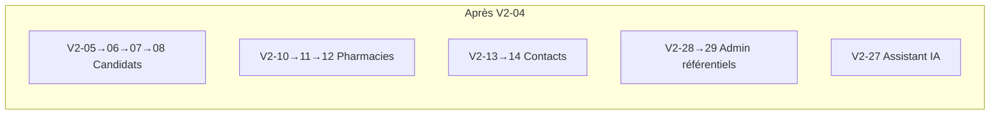

# Graphe de dépendances — Issues CRM MediJob V2

> **Epic parente** : [#19 — PRD V2](https://github.com/Piamias-Victor/crm-medijob/issues/19)  
> **Statut** : découpage validé (31 slices, `ready-for-agent`)  
> **Sources** : `docs/PRD.md`, `SPEC_V2.md`, `CONTEXT.md`, ADRs 0001–0010  
> **Mapping GitHub** : V2-01 → [#50](https://github.com/Piamias-Victor/crm-medijob/issues/50) … V2-31 → [#80](https://github.com/Piamias-Victor/crm-medijob/issues/80)

---

## Vue d'ensemble des 31 issues

| ID | GitHub | Milestone | Titre |
|----|--------|-----------|-------|
| V2-01 | [#50](https://github.com/Piamias-Victor/crm-medijob/issues/50) | Bloc 0 — Fondations | `[FONDATIONS] Bootstrap Next.js + tokens Medijob + atoms UI` |
| V2-02 | [#51](https://github.com/Piamias-Victor/crm-medijob/issues/51) | Bloc 0 — Fondations | `[FONDATIONS] Page /design-system — 12 sections charte Medijob` |
| V2-03 | [#52](https://github.com/Piamias-Victor/crm-medijob/issues/52) | Bloc 0 — Fondations | `[FONDATIONS] Schéma Prisma V2 + seeds + repositories + Testcontainers` |
| V2-04 | [#53](https://github.com/Piamias-Victor/crm-medijob/issues/53) | Bloc 0 — Fondations | `[FONDATIONS] Auth NextAuth v5 — login Argon2id + middleware + rôles` |
| V2-05 | [#54](https://github.com/Piamias-Victor/crm-medijob/issues/54) | Bloc 1 — Candidats | `[CANDIDATS] CVthèque liste + kanban PipelineStage + inbox Applications` |
| V2-06 | [#55](https://github.com/Piamias-Victor/crm-medijob/issues/55) | Bloc 1 — Candidats | `[CANDIDATS] Fiche Candidate — profil, contract preferences, bandeau incomplet` |
| V2-07 | [#56](https://github.com/Piamias-Victor/crm-medijob/issues/56) | Bloc 1 — Candidats | `[CANDIDATS] Upload CV — extraction IA + revue humaine obligatoire` |
| V2-08 | [#57](https://github.com/Piamias-Victor/crm-medijob/issues/57) | Bloc 1 — Candidats | `[CANDIDATS] cvSummary IA + dossier anonymisé + export PDF Medijob` |
| V2-09 | [#58](https://github.com/Piamias-Victor/crm-medijob/issues/58) | Bloc 1 — Candidats | `[CANDIDATS] ActivityLog Candidate — timeline filtrable` |
| V2-10 | [#59](https://github.com/Piamias-Victor/crm-medijob/issues/59) | Bloc 2 — Pharmacies & Contacts | `[PHARMACIES] Portefeuille Pharmacy — liste, CRUD, lookup SIRET + TVA` |
| V2-11 | [#60](https://github.com/Piamias-Victor/crm-medijob/issues/60) | Bloc 2 — Pharmacies & Contacts | `[PHARMACIES] Fiche Pharmacy — Contacts, Besoins en cours, création Mission` |
| V2-12 | [#61](https://github.com/Piamias-Victor/crm-medijob/issues/61) | Bloc 2 — Pharmacies & Contacts | `[PHARMACIES] Documents Pharmacy — upload Vercel Blob` |
| V2-13 | [#62](https://github.com/Piamias-Victor/crm-medijob/issues/62) | Bloc 2 — Pharmacies & Contacts | `[PHARMACIES] Module Contact — liste + fiche (1 Pharmacy obligatoire)` |
| V2-14 | [#63](https://github.com/Piamias-Victor/crm-medijob/issues/63) | Bloc 2 — Pharmacies & Contacts | `[PHARMACIES] ActivityLog Pharmacy & Contact` |
| V2-15 | [#64](https://github.com/Piamias-Victor/crm-medijob/issues/64) | Bloc 3 — Missions | `[MISSIONS] Liste + kanban Mission status` |
| V2-16 | [#65](https://github.com/Piamias-Victor/crm-medijob/issues/65) | Bloc 3 — Missions | `[MISSIONS] Fiche Mission — CRUD + transitions POURVU/ANNULEE` |
| V2-17 | [#66](https://github.com/Piamias-Victor/crm-medijob/issues/66) | Bloc 3 — Missions | `[MISSIONS] MissionCandidate — positionner + kanban + drag` |
| V2-18 | [#67](https://github.com/Piamias-Victor/crm-medijob/issues/67) | Bloc 3 — Missions | `[MISSIONS] ActivityLog & Documents Mission` |
| V2-19 | [#68](https://github.com/Piamias-Victor/crm-medijob/issues/68) | Bloc 4 — Offres d'emploi | `[OFFRES] Génération JobOffer IA depuis Mission` |
| V2-20 | [#69](https://github.com/Piamias-Victor/crm-medijob/issues/69) | Bloc 4 — Offres d'emploi | `[OFFRES] Module /offres — liste + fiche + statuts` |
| V2-21 | [#70](https://github.com/Piamias-Victor/crm-medijob/issues/70) | Bloc 4 — Offres d'emploi | `[OFFRES] Publication Webflow CMS — publier / dépublier` |
| V2-22 | [#71](https://github.com/Piamias-Victor/crm-medijob/issues/71) | Bloc 5 — Candidatures | `[CANDIDATURES] Webhook Webflow — réception Application + HMAC` |
| V2-23 | [#72](https://github.com/Piamias-Victor/crm-medijob/issues/72) | Bloc 5 — Candidatures | `[CANDIDATURES] Traitement inbox — dédup, fusion diff, accept/refuse` |
| V2-24 | [#73](https://github.com/Piamias-Victor/crm-medijob/issues/73) | Bloc 6 — IA avancée | `[IA] Matching Mission → Candidates — pré-filtre + Gemini` |
| V2-25 | [#74](https://github.com/Piamias-Victor/crm-medijob/issues/74) | Bloc 6 — IA avancée | `[IA] Matching inversé Candidate → Missions` |
| V2-26 | [#75](https://github.com/Piamias-Victor/crm-medijob/issues/75) | Bloc 6 — IA avancée | `[IA] Contact depuis matching — email Resend + tel/WhatsApp` |
| V2-27 | [#76](https://github.com/Piamias-Victor/crm-medijob/issues/76) | Bloc 6 — IA avancée | `[IA] Assistant IA — chat contextuel + 6 raccourcis` |
| V2-28 | [#77](https://github.com/Piamias-Victor/crm-medijob/issues/77) | Bloc 7 — Admin & finitions | `[ADMIN] Référentiels — Pipeline, Software, Groupement, JobTitle + matrice` |
| V2-29 | [#78](https://github.com/Piamias-Victor/crm-medijob/issues/78) | Bloc 7 — Admin & finitions | `[ADMIN] Utilisateurs — CRUD + rôles RECRUTEUR/ADMIN` |
| V2-30 | [#79](https://github.com/Piamias-Victor/crm-medijob/issues/79) | Bloc 7 — Admin & finitions | `[ADMIN] Recherche globale cross-entités` |
| V2-31 | [#80](https://github.com/Piamias-Victor/crm-medijob/issues/80) | Bloc 7 — Admin & finitions | `[ADMIN] Soft delete UI + rapport semaine assistant` |

---

## Dépendances (Blocked by)

```
#50  →  (aucun)
#51  →  #50
#52  →  #50
#53  →  #52

#54  →  #53
#55  →  #54
#56  →  #55
#57  →  #56
#58  →  #55

#59  →  #53
#60  →  #59
#61  →  #60
#62  →  #59
#63  →  #60, #62

#64  →  #54, #59
#65  →  #64
#66  →  #65, #54
#67  →  #65

#68  →  #65
#69  →  #68
#70  →  #69

#71  →  #70, #54
#72  →  #71, #54

#73  →  #66, #52
#74  →  #73
#75  →  #73
#76  →  #53

#77  →  #53
#78  →  #77
#79  →  #54, #59, #64
#80  →  #79, #76
```

---

## Vagues de livraison (chemin critique)

Chaque vague ne démarre que quand **tous** ses prérequis sont mergés sur `dev`.

| Vague | Issues débloquées | Parallélisable |
|-------|-------------------|----------------|
| **0** | V2-01 | Non — point d'entrée unique |
| **1** | V2-02, V2-03 | **Oui — 2 agents** (design-system ∥ prisma) |
| **2** | V2-04 | Non |
| **3** | V2-05, V2-10, V2-27, V2-28 | **Oui — 4 agents** (4 pistes indépendantes) |
| **4** | V2-06, V2-11, V2-13 | **Oui — 3 agents** |
| **5** | V2-07, V2-09, V2-12, V2-15 | **Oui — 4 agents** (V2-15 attend V2-05+V2-10) |
| **6** | V2-08, V2-14, V2-16 | **Oui — 3 agents** |
| **7** | V2-17, V2-18, V2-19 | **Oui — 3 agents** |
| **8** | V2-20 | Non |
| **9** | V2-21 | Non |
| **10** | V2-22 | Non |
| **11** | V2-23, V2-24, V2-29 | **Oui — 3 agents** |
| **12** | V2-25, V2-26 | **Oui — 2 agents** |
| **13** | V2-30 | Non |
| **14** | V2-31 | Non |

**Chemin critique** (séquentiel le plus long) :

```
V2-01 → V2-03 → V2-04 → V2-05 → V2-06 → V2-07 → V2-08
                                                      ↘
V2-01 → V2-03 → V2-04 → V2-10 → V2-11 → V2-15 → V2-16 → V2-19 → V2-20 → V2-21 → V2-22 → V2-23
                                                              ↘
                                                         V2-17 → V2-24 → V2-25
```

Durée minimale séquentielle : **14 étapes** si un seul agent. Avec 4 agents en vague 3, le portefeuille se construit en parallèle.

---

## Pistes parallèles stables (tracks)

Une fois **V2-04** mergé, quatre pistes peuvent avancer **indépendamment** sans conflits de domaine :



| Piste | Issues | Convergence avec |
|-------|--------|------------------|
| **A — Candidats** | 05 → 06 → 07 → 08 ; 09 en // de 07 | Missions (15, 17), Candidatures (22, 23), Matching (24) |
| **B — Pharmacies** | 10 → 11 → 12 | Missions (15), Recherche globale (30) |
| **C — Contacts** | 13 → 14 (après 11 pour 14) | — |
| **D — Admin** | 28 → 29 | Utilisateurs avant finitions |
| **E — Assistant** | 27 (dès V2-04) | Soft delete + rapport (31) |

**Convergence Missions** : V2-15 exige **A** (V2-05) + **B** (V2-10) — c'est le premier point de sync entre pistes Candidats et Pharmacies.

**Convergence Offres → Candidatures** : chaîne séquentielle 19 → 20 → 21 → 22 → 23 (un agent ou file d'attente dédiée Webflow).

---

## Matrice « qui peut tourner en même temps »

Lecture : deux issues sont parallélisables si **aucune n'est ancêtre** de l'autre et si **tous leurs Blocked by** sont satisfaits.

| Si ces issues sont DONE | Tu peux lancer en parallèle |
|-------------------------|----------------------------|
| V2-01 | V2-02 + V2-03 |
| V2-03 | V2-04 |
| V2-04 | **V2-05 + V2-10 + V2-27 + V2-28** |
| V2-05 + V2-10 | V2-15 |
| V2-05 | V2-06 |
| V2-10 | V2-11 + V2-13 |
| V2-06 | V2-07 + V2-09 |
| V2-11 + V2-13 | V2-14 |
| V2-15 | V2-16 |
| V2-16 | V2-17 + V2-18 + V2-19 |
| V2-17 + V2-03 | V2-24 |
| V2-24 | V2-25 + V2-26 |
| V2-05 + V2-10 + V2-15 | V2-30 |
| V2-30 + V2-27 | V2-31 |

---

## Conflits à anticiper (même repo, branches qui touchent)

Même parallélisable sur le graphe, ces paires ont **forte probabilité de conflit git** :

| Paire | Raison |
|-------|--------|
| V2-02 ∥ V2-03 | Tous deux touchent `apps/web/src/` dès le bootstrap |
| V2-05 ∥ V2-10 | Routers tRPC + layouts dashboard |
| V2-17 ∥ V2-18 | Même fiche `/missions/[id]` |
| V2-25 ∥ V2-26 | Même onglet Matching |

**Recommandation** : paralléliser de préférence des **pistes différentes** (A + B + D + E en vague 3) plutôt que des issues du même module.

---

## Ordre de publication GitHub

Publier dans l'ordre des dépendances pour référencer les vrais `#N` dans « Blocked by » :

1. V2-01 → … → V2-04 (fondations)
2. V2-05, V2-10, V2-27, V2-28 (parallèle possible, publier séquentiellement pour numéros)
3. Continuer vague par vague

---

## Label & workflow agent

- Toutes les issues : **`ready-for-agent`**
- Branche : `feat/issue-{N}-{slug}`
- PR vers `dev` avec `Closes #N`
- Handoff : `docs/handoffs/HANDOFF_ISSUE_{N}.md`

---

## Issues V1 obsolètes

Issues **#1–#17** et **#20–#49** (script) : **fermées**. Ne pas rouvrir — domaine V1 incompatible (ContactPharmacy N-N, CandidateStatus, MissionStatus OUVERTE, etc.).
